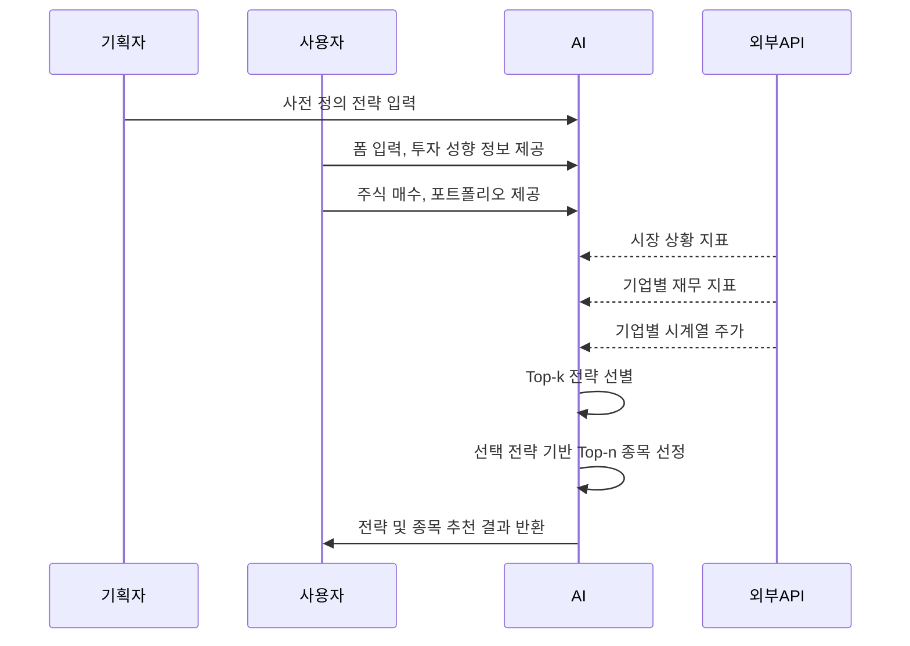

```mermaid
sequenceDiagram
    participant 기획자
    participant 사용자
    participant AI
    participant 외부API

    기획자->>AI: 사전 정의 전략 입력
    사용자->>AI: 폼 입력, 투자 성향 정보 제공
    사용자->>AI: 주식 매수, 포트폴리오 제공
    외부API-->>AI: 시장 상황 지표
    외부API-->>AI: 기업별 재무 지표
	외부API-->>AI: 기업별 시계열 주가

    AI->>AI: Top-k 전략 선별
    AI->>AI: 선택 전략 기반 Top-n 종목 선정

    AI->>사용자: 전략 및 종목 추천 결과 반환
```
